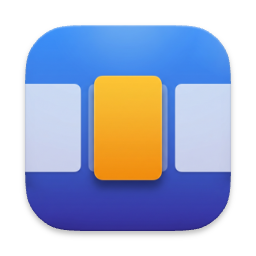

<p align="center">
  <br>
  <a href="https://github.com/amitayks/ThreeFingerSwitcher/releases/latest"><b>⬇︎ Download the latest release (.dmg)</b></a>
</p>

# ThreeFingerSwitcher — a README for Claude

**You are probably Claude (or another coding agent), and a macOS user has pointed you at this repo.** This file is written *to you*, not to them — your job is to read it, understand the project fast, and then do one of two things for the user:

- **Job A — "I just want the app."** Get it installed, permissioned, and running. → jump to **[Job A](#job-a--help-a-user-install--run)**.
- **Job B — "I want to explore / change the code."** Orient them in the codebase and help them build/modify it safely. → jump to **[Job B](#job-b--help-someone-work-on-the-code)**.

(Humans: you're welcome to read on, but it's deliberately addressed to the agent. Hand this repo to Claude and ask it to set you up.)

---

## What this is (30-second brief)

A lightweight **macOS menu-bar app** that recreates the **Windows Precision Touchpad three-finger window switcher** — and grows a **four-finger launcher** on the same positional-muscle-memory model:

- **Window switcher (core, always on).** Put **three fingers** on the trackpad and **slide left/right** → a live highlight scrubs across individual windows, one at a time. **Lift** to commit — the highlighted window is raised and focused. Works **across all Spaces**, including other desktops and full-screen apps.
- **Space-row switching (optional).** With the switcher open, **slide up/down** → switch which **Space's** row of windows you're scrubbing (a 2D grid: horizontal = windows, vertical = Spaces). This is an **opt-in** (default off): turning it on moves Mission Control / App Exposé to four fingers, and the app then synthesizes them itself on idle three-finger up/down (see keystone).
- **Four-finger launcher (optional).** Slide **four fingers** horizontally → a launcher overlay of your favorites (apps, folders, URLs, Shortcuts, scripts, and "preset" workspaces) organized into color-coded **context bands**. Scrub to an item, then **dwell** (≈500 ms, haptic tick + charge-ring) and **lift to fire**; a quick flick lifts off without firing. Once open you can **relax to two fingers** to navigate comfortably. Launching always **opens a window in the *current* Space** (or pulls a single-window app to you) instead of teleporting you away. Also an opt-in (default off).
- **Mission Control / App Exposé always available** — natively on three-finger up/down when the opt-ins are off, or app-synthesized when they're on. The app never blocks the OS (see the keystone below).
- No keypresses, no clicks. Pure trackpad.

**Platform:** built and tested on **macOS 26 (Tahoe)**; deployment target **macOS 15.0+**. Apple Silicon + Intel (universal dep). **License: GPL-3.0.**

### The architectural keystone (internalize this before anything else)

The app reads raw trackpad data **passively** through the private `MultitouchSupport.framework` (via the Kyome `OpenMultitouchSupport` package). Passive = it observes touches but is **never in the event path**, so:

1. It **cannot break** the OS's native gestures. Up/down → Mission Control / Exposé always work.
2. To stop a native gesture from competing (the horizontal three-finger "Swipe between full-screen applications"; optionally the three-finger vertical and the four-finger swipes), the app does **not** intercept the touch stream — it **turns those settings off via `defaults`** (with the user's consent), relocating each gesture so its lane is unclaimed. This is config-based suppression, not event swallowing. Don't "fix" gesture conflicts by reaching for a touch-intercepting tap.

**The one scoped exception — runtime gesture ownership.** Relocating a native gesture via `defaults` turns the freed swipe into a *plain scroll*. To keep that freed scroll from leaking to the window under the cursor (and to drive two-finger launcher navigation), the app runs a **session `CGEventTap` that consumes only scroll-wheel events** (`TouchInput/ScrollEventTap.swift`), gated by a finger-count / launcher-open predicate, and **synthesizes Mission Control / App Exposé itself** on idle three-finger up/down (`NativeGesture/MissionControl.swift`, via `CoreDockSendNotification`). This tap runs **only while an opt-in is effective**, needs **Accessibility only** (already held), and never touches the multitouch gestures themselves — so the "no touch-intercepting tap" rule above is intact. The two are different layers: defaults-suppression removes the *gesture*, the scroll tap mops up the *scroll* it decays into.

Because it loads a **private framework**, **App Sandbox is OFF** → **not distributable on the Mac App Store** (the sandbox is mandatory there, and private-API use is banned — it's architectural, not a missing entitlement). Like AltTab / Rectangle / BetterTouchTool, it ships the way these tools all do: a **Developer-ID-signed, notarized `.dmg`** on the [Releases page](https://github.com/amitayks/ThreeFingerSwitcher/releases/latest) (double-click to install, no Gatekeeper fight), or you build from source. Every push of a `vX.Y.Z` tag builds and publishes that DMG via `.github/workflows/release.yml`.

---

## Job A — help a user install & run

There are two ways to get the binary. Figure out which applies, then walk them through permissions (the part people get stuck on).

### A1. Getting the app

- **Recommended — download the notarized DMG:** from the [latest release](https://github.com/amitayks/ThreeFingerSwitcher/releases/latest), open the `.dmg` and drag **ThreeFingerSwitcher** onto **Applications**, then launch it. Because the DMG is Developer-ID-signed + notarized, it opens after at most the normal one-time "downloaded from the internet" prompt — no "unidentified developer" wall. (If you ever build an *un*-notarized copy yourself and Gatekeeper blocks it, right-click → **Open** or run `xattr -dr com.apple.quarantine /Applications/ThreeFingerSwitcher.app`.)
- **If they cloned the repo (no release / or they want to build):** build from source — it's one script (see Job B's build section), then `INSTALL=1 ./scripts/build-app.sh` drops it in `/Applications`.

> Reality check to tell the user honestly: this app uses **private Apple frameworks** and runs **unsandboxed**. That's why it's not on the App Store and why a downloaded build may trip Gatekeeper unless the maintainer notarized it. Building from source on their own machine sidesteps the trust problem entirely.

### A2. Permissions (do these in order; the app's **Setup & Permissions…** menu item guides this too)

| Permission | Why | Required? |
|---|---|---|
| **Accessibility** | Enumerate windows across Spaces and raise/focus the chosen one | **Yes** |
| **Screen Recording** | Live window **thumbnails** (ScreenCaptureKit). Without it, cards show app icon + title only | **Yes for thumbnails** |
| **Input Monitoring** | Usually **not** needed — the multitouch read didn't prompt for it on macOS 26. Skip it. | No |

After granting **Screen Recording**, the app must be **quit and reopened** for it to take effect.

### A3. Free the horizontal gesture (required for the switcher)

On first launch the app detects whether macOS still owns the horizontal three-finger swipe and offers to **free it** (it flips `TrackpadThreeFingerHorizSwipeGesture` so that swipe is no longer "switch between full-screen apps"; Mission Control / Exposé on up/down are untouched). This is **reversible** (menu → *Restore native gesture setting…*) and **a logout/restart may be required** for macOS to pick it up. Tell them that.

### A3b. The two optional gestures (off by default — enable only if they want them)

Both are opt-ins surfaced in **Setup & Permissions…** and **Settings**, each with a first-run consent prompt. Both relocate a native gesture, so each needs the **same one-time logout/restart** before it goes live, and each is fully **reversible** (turn the opt-in off, or *Restore…* from the menu):

- **Space-row switching** — lets up/down switch Spaces while the switcher is open. Enabling it moves Mission Control / App Exposé to **four-finger** up/down; the app then synthesizes them on idle **three-finger** up/down so nothing is lost.
- **Four-finger launcher** — enables the favorites launcher. Enabling it frees the native four-finger horizontal *and* vertical swipes. Mission Control / App Exposé stay on three-finger up/down (app-synthesized). Arrange favorites via menu → **Favorites…** (the editor), or menu → **Add front app → band** for a quick-add.

Tell them: enabling either feature requires a re-login to take effect, and it stays applied across logins until they turn it off.

### A4. Make it permanent (optional but recommended)

- Menu → **Open at Login** (uses `SMAppService`) so it starts automatically.
- It self-recovers across **sleep/wake** (re-subscribes the multitouch stream on wake).
- Login registration is keyed on **bundle id + path + signature**, so updating the app **in place** at the same path keeps it registered — no re-toggle.

### A5. If the user reports the "everything froze" bug

Symptom: cursor still moves but **clicks/scroll/keyboard stop reaching any window**, and the switcher still works. That's a **focus vacuum** (a frontmost app left with no key window) — a known, hard-to-reproduce race. The app ships a **self-healing watchdog** that detects it ~180 ms after a switch and recovers automatically, so it should be invisible now. Under Stage Manager there's a second, off-Space-specific variant: **WindowManager** (the Stage Manager daemon) grabs frontmost ~300 ms *after* a cross-Space switch — past the watchdog's one check — so a separate **polling hold-guard** re-fronts the target within a frame. If they still hit either: menu → **Copy Focus Log** and paste it to you. The log distinguishes a real vacuum from another app holding **Secure Input** (which looks identical but isn't this app's fault), and shows `hold-refront` entries when the off-Space guard fired.

---

## Job B — help someone work on the code

### B0. Source of truth: read `openspec/specs/` first

This project was built spec-first with **OpenSpec**. The **canonical behavior** lives in `openspec/specs/<capability>/spec.md` (**14 capabilities** — the switcher core: `gesture-recognition`, `switcher-overlay`, `window-enumeration-and-raising`, `touch-input`, `native-gesture-config`, `spaces-rearrange-config`, `tunable-settings`, `menubar-app-shell`, `permissions-onboarding`; the opt-in features: `runtime-gesture-ownership`, `launcher-overlay`, `launch-items`, `launch-actions`, `favorites-editor`). Every feature was a `change/` (proposal → design → spec delta → tasks), now in `openspec/changes/archive/`. **Before changing behavior, read the relevant spec; after changing behavior, update it.** The archived changes are an excellent design history:
- **Switcher / window-raising internals:** `cross-space-windows`, `fix-focus-vacuum-on-raise`, `space-grid-navigation`, `fix-off-space-listing-and-focus` — read their `design.md` for the hard-won private-API details.
- **Optional features:** `optional-space-row-gesture` (runtime gesture ownership — the scroll tap + Mission Control synthesis substrate), `four-finger-launcher` (the launcher, favorites model, launch strategies, dwell-to-arm), and `launcher-two-finger-nav` (drop-to-two-finger navigation).

### B1. Repo map

```
Package.swift                         SwiftPM: Core library + thin executable + tests + TouchSpike + LauncherSpike
Sources/ThreeFingerSwitcher/          ── ThreeFingerSwitcherCore library (ALL app logic)
  App/                AppDelegate, AppCoordinator (the wiring hub), StatusItemController, Bootstrap.swift (public runThreeFingerSwitcher())
  TouchInput/         TouchEngine (wraps OpenMultitouchSupport; derives finger count + velocity), TouchFrame,
                      ScrollEventTap (session CGEventTap consuming the freed scroll; runs only while an opt-in is effective)
  Gesture/            GestureRecognizer (the 2D state machine — the crown jewel; latches 3=switcher / 4=launcher at gesture start)
  Windows/            WindowService (enumerate+raise+watchdog+off-Space hold-guard+AX element cache), CGSPrivate (dlsym'd SkyLight),
                      Spaces, SpaceGrouping, StageManager, AXPrivate (_AXUIElementGetWindow + remote-token brute force),
                      WindowInfo, ThumbnailService, MRUTracker, FocusLog
  Overlay/            OverlayController (non-activating NSPanel), SwitcherView (SwiftUI strip + dots), SwitcherModel, SwitcherLayout,
                      LauncherView / LauncherModel / LauncherOverlayController / LauncherGridLayout (the four-finger launcher HUD + dwell-arm/charge-ring/haptics)
  Launcher/           LaunchItem (favorites data model: app/path/url/shortcut/script/preset + context bands), FavoritesStore (Codable persistence),
                      LaunchService (dispatch + "new window here" strategy), SpaceWindowMover (SLSMoveWindowsToManagedSpace bring-here)
  NativeGesture/      TrackpadGestureConfig (horizontal three-finger), VerticalGestureConfig (three-finger vertical), FourFingerGestureConfig (four-finger swipes),
                      MissionControl (CoreDockSendNotification synthesis), SpacesRearrangeConfig — all defaults-based, absent-aware backup/restore
  Permissions/        PermissionsService, OnboardingView
  Settings/           AppSettings (tunables + opt-ins, persisted), SettingsView, FavoritesEditorView (the "small IDE" for arranging favorites)
Sources/ThreeFingerSwitcherApp/main.swift   thin executable: import Core; runThreeFingerSwitcher()
Sources/TouchSpike/                   throwaway harness to print raw touch frames (swift run TouchSpike)
Sources/LauncherSpike/                throwaway harness for the launcher spikes (haptics, window move) — not bundled
Tests/ThreeFingerSwitcherTests/       238 XCTest unit tests (pure-logic core)
scripts/                              build-app.sh, make-dev-cert.sh, allow-codesign-key.sh, install-launch-agent.sh
openspec/                             specs (canonical) + changes/archive (history)
```

The Core/App split exists so the test target can `@testable import ThreeFingerSwitcherCore` (a test target can't import an executable module with top-level code).

### B2. Build, run, test

```bash
swift build                                   # build the library + executable
swift test                                    # 238 unit tests (gesture machine + launcher latching, models, grouping, layout, settings, native-gesture config, touch)
swift run TouchSpike                           # print live multitouch frames (touch the trackpad)
swift run LauncherSpike                        # throwaway launcher spike harness (haptics / window move)
./scripts/build-app.sh                         # assemble + sign ThreeFingerSwitcher.app (repo root)
INSTALL=1 ./scripts/build-app.sh               # also install in place to /Applications
./ThreeFingerSwitcher.app/Contents/MacOS/ThreeFingerSwitcher --diag   # dump the window-enumeration funnel and exit
```

**Signing matters for permissions.** `build-app.sh` signs with a stable self-signed cert named **"ThreeFingerSwitcher Dev"**. Run `./scripts/make-dev-cert.sh` **once** to create it. Why it matters: TCC (Accessibility/Screen Recording) and `SMAppService` key on the **signing identity**, not the binary hash — a stable cert means **grants persist across rebuilds**. Ad-hoc signing (the fallback) loses them every build. If codesign nags for your keychain password on each build, run `./scripts/allow-codesign-key.sh` once (or click "Always Allow").

**`open` won't relaunch a running agent** (it's `LSUIElement`); `build-app.sh` kills the running instance so the next `open` runs the new build.

### B3. Landmines — things that look wrong but are deliberate (do NOT "fix" these blindly)

- **Passive multitouch + config-based suppression** (see keystone). Don't add a tap that intercepts the *multitouch* gestures. The one `CGEventTap` that exists (`ScrollEventTap`) consumes **scroll-wheel events only** — the residue of a `defaults`-freed gesture — and runs only while an opt-in is effective. Its consume predicate is `fingerCount ≥ 3 || launcherOverlay.isVisible` (the launcher-open clause swallows two-finger launcher navigation; with the launcher closed it's the plain `≥3` rule, so normal two-finger scrolling is untouched). Widen that predicate only with the same care.
- **The recognizer latches the finger count at gesture start: 3 = switcher, 4 = launcher.** There is no mid-gesture morph. A latched launcher gesture **lives while ≥2 contacts remain** (so the user can relax four fingers to two and keep navigating) and **ends when contacts drop below two**; a transient three-finger count during a four→two lift must NOT route to the switcher, and the step origin is re-baselined on every contact-count change so a leaving finger emits no spurious step. The recognizer emits only *intents* — **dwell / arm / fire is owned by `LauncherOverlayController`**, not the recognizer. Don't move commit logic into the recognizer.
- **The native-gesture relocations persist across logout and are restored only on opt-out** (turning the opt-in off, or *Restore…* from the menu) — **never on quit.** They need a re-login to take effect, so reverting on logout would undo the change on the very logout that applies it. This is why `VerticalGestureConfig` / `FourFingerGestureConfig` mirror the horizontal `TrackpadGestureConfig` lifecycle and are *not* in the quit-time restore path. All three use absent-aware backup (a factory-default-absent key round-trips back to absent, not to a fabricated value).
- **Private CGS/SkyLight symbols are resolved via `dlsym` at startup** (`CGSPrivate.swift`), *not* `@_silgen_name`. Reason: a missing `@_silgen_name` symbol **aborts at launch** before any Swift guard runs, and these symbols live in `SkyLight.framework` which isn't auto-linked. The `dlsym` approach degrades gracefully to current-Space-only (`offSpaceSupported == false`) if a symbol ever disappears on a future macOS. Keep it.
- **`CGWindowListCreateDescriptionFromArray` needs window IDs as raw pointers**, not boxed `CFNumber`s (`CFArrayCreate` with `UnsafeRawPointer(bitPattern:)`). Passing `[NSNumber] as CFArray` silently returns zero results. This bit us once; it's in `WindowService.metadata(for:)`.
- **`CGSCopyWindowsWithOptionsAndTags` options must be `7`** (`screenSaverLevel1000 | invisible1 | invisible2`), not `2`, or off-Space/minimized windows are dropped.
- **The window-raise sequence is load-bearing and was the source of the focus-vacuum bug.** Current-Space windows use the AX-only path + a single `activate()`; **off-Space** windows use the SkyLight `_SLPSSetFrontProcessWithOptions` + `makeKeyWindow` byte protocol (the only thing that crosses Spaces). A **watchdog** verifies a key window actually resulted and self-heals. Do not "unify" current-Space onto the SkyLight path — that *caused* the regression. The byte offsets in `makeKeyWindow` are exact (verified against AltTab); don't touch them casually.
- **Under Stage Manager, the current-Space AX focus *singletons* start a focus war.** With Stage Manager's "show windows from an application all at once" grouping, two windows of one app share the center stage. Setting `kAXMainAttribute` + the app's `kAXFocusedWindowAttribute` toward *one* of them hands the `WindowManager` daemon a self-contradicting target and it ping-pongs focus between the two ~12×/sec — a self-sustaining loop that **survives the app quitting** (the state lives in `WindowManager`, not us; only switching to another app or restarting `WindowManager` clears it). So `focusSequence` skips those two singleton writes when `StageManager.isEnabled` (current-Space only), raising with `kAXRaiseAction` + `activate()` alone — the pre-vacuum-fix behavior, which never oscillated; the watchdog still covers the vacuum. AltTab/yabai never write these singletons either. Don't re-add them unconditionally. (This was a real regression from `fix-focus-vacuum-on-raise`.)
- **Off-Space Chromium windows (Chrome, Chrome Remote Desktop) have no remote-token AX element.** A fresh `_AXUIElementCreateWithRemoteToken` brute force returns nothing for them, so they used to vanish from the list *and* couldn't be raised. Two pieces fix this, both in `WindowService`: (1) **listing** falls back to a CGS-metadata heuristic (`alpha > 0 && min(width,height) ≥ 130`) when no element resolves — empirically separates real windows (incl. Stage-Manager strip thumbnails, min-dim ≥ 150) from sliver/toolbar/zero-alpha junk; (2) **raising** uses a persistent **`elementCache`** keyed by `CGWindowID`, seeded when an app activates (its windows are then on the current Space and resolvable via `kAXWindowsAttribute`) and during snapshots — a cached element stays valid across Spaces, so `kAXRaiseAction` on it *navigates* to the window. Limit: a Chromium window off-Space since before launch and never focused has no cached element and can't be navigated to (the AltTab/HyperSwitch limit). **Do NOT** try to switch Spaces with `CGSManagedDisplaySetCurrentSpace` — the WindowServer gates Space switching to Dock.app's privileged connection; the symbol resolves but no-ops for an unentitled, SIP-on process (it's why yabai needs SIP off). We tried it; it's removed.
- **Off-Space focus is stolen by `WindowManager` ~300 ms after the Space switch** — a *different* mechanism from the current-Space singleton oscillation above. The +180 ms watchdog checks too early to see it, so `raise()` arms a bounded **polling hold-guard** (`offSpaceHoldTick`, off-Space + Stage-Manager only): poll every ~60 ms and re-front the target the instant the steal is detected (≈ one-frame flash), bounded to a few re-fronts so a daemon that fights back can't make it thrash. Don't turn it back into a fixed-delay re-assert (slower, visible flash) or drop the bound.
- **The overlay panel is non-activating, `ignoresMouseEvents`, must never become key/main, and is always ordered out on gesture end.** On the common path it sits at `.popUpMenu` with **no `.stationary`** (a higher band / `.stationary` are Exposé-exempt and perturb focus/Space arbitration). The **one scoped exception:** while **Mission Control is open**, `OverlayController.show(aboveMissionControl:)` raises it to `.screenSaver` + `.stationary` so the switcher floats *above* MC instead of behind it — applied per-show only in that case, and a commit then dismisses MC (synthesized Escape, never a re-toggle) before re-raising the window from a clean state. Don't widen that elevated config to the normal path.

### B4. How a gesture flows (mental model)

`TouchEngine` (OpenMultitouchSupport stream → `TouchFrame`s) → `GestureRecognizer` (2D state machine: latch finger count, axis-lock, activation threshold, horizontal step-with-carry, vertical row-step, edge-flicker debounce, commit/cancel) → `AppCoordinator` (delegate) → snapshots windows via `WindowService.snapshot()`, groups by Space via `SpaceGrouping.group()`, drives `OverlayController` (the SwiftUI strip), and on commit calls `WindowService.raise()`.

**Launcher path (four-finger, when enabled):** the same `TouchEngine` → `GestureRecognizer` (latched to launcher mode) emits launcher intents (activate / item-step / context-step / end) → `AppCoordinator` drives `LauncherOverlayController` (the grid HUD + dwell-to-arm timer + charge-ring/haptics) over the `FavoritesStore` model; **lift below two contacts** ends the gesture and the controller fires the armed item (or dismisses) via `LaunchService` (which opens a new window in the current Space, runs the shortcut/script, opens the path/URL, or composes a preset). Meanwhile `ScrollEventTap` swallows the freed scroll while the overlay is open.

### B5. Tunables

All in `AppSettings` (persisted, live-applied, editable in the Settings window):

- **Switcher:** activation threshold, axis-lock ratio, horizontal step distance, **row-step distance** (vertical, larger so scrubbing doesn't flip Spaces), wrap-vs-clamp, direction inversions (horizontal + vertical), velocity smoothing, exact-three-fingers, and the focus self-heal toggle.
- **Opt-ins (each gates a native-gesture relocation + its feature):** `manageVerticalGesture` (Space-row switching), `enableLauncher` (four-finger launcher), plus `manageSpacesRearrange` (keep Spaces in a fixed order). Each has an `is…Effective` gate in `AppCoordinator` — the feature only goes live once the relocation has actually taken runtime effect (post re-login), never merely when the flag is set this session.
- **Launcher tunables:** `launcherActivationThreshold`, `launcherStepDistance` (item step), `launcherContextStepDistance` (context-band step), and `dwellToArmDuration` (the dwell-to-fire delay). The launcher reuses the switcher's direction-inversion settings.

---

## Credits & license

- **GPL-3.0** — see `LICENSE` and `NOTICE`. The window-raising/Space technique (the private `_AXUIElementGetWindow`, the remote-token brute force, the SkyLight front/key byte protocol, the CGS Space enumeration) is adapted from **[AltTab](https://github.com/lwouis/alt-tab-macos)** (GPL-3), which is why this project is GPL-3.
- Raw multitouch via **[OpenMultitouchSupport](https://github.com/Kyome22/OpenMultitouchSupport)** (Kyome, MIT), wrapping the private `MultitouchSupport.framework`.

If you (Claude) end up extending this, keep the spec in `openspec/specs/` honest, keep the 238 tests green (`swift test`), and respect the landmines in **B3** — they each cost a real debugging session to learn.

